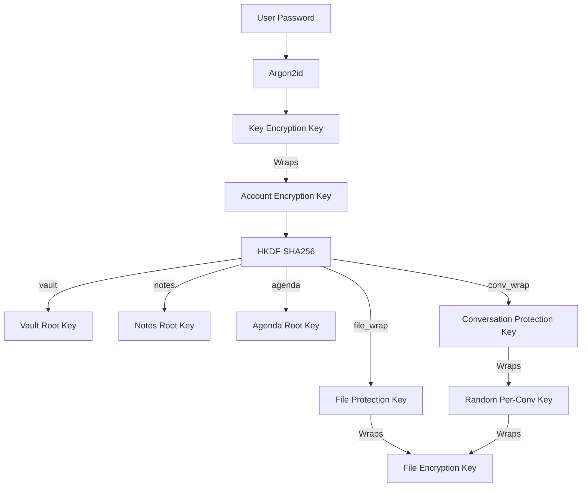

# Keeftalk — Final E2EE & Cloud Sync Security Audit

This report summarizes the final end-to-end encrypted (E2EE) architecture and the results of the comprehensive security hardening performed in Parts 1–4.

## A. Final Key Hierarchy (Hierarchical Domain-Separated)

Keeftalk now uses a cryptographically robust key hierarchy rooted in the user's password.

## B. Core Security Results

| Category | Security Status | Implementation Details |
| :--- | :--- | :--- |
| **Account Recovery** | **ZERO-KNOWLEDGE** | Recovered via Password + AEK Envelope. Server never sees plaintext root. |
| **Messaging** | **FULL E2EE** | Cryptographically random PCKs. No deterministic derivation from IDs. |
| **Group Security** | **EPOCH-BASED** | Keys rotate (increment epoch) on membership changes. |
| **File Storage** | **ENVELOPED** | FEKs are wrapped in recipient-specific envelopes. Plaintext FEKs are NEVER uploaded. |
| **Metadata** | **ENCRYPTED** | Filenames, titles, and MIME types are encrypted with purpose-specific keys. |
| **Deduplication** | **PRIVACY-PRESERVING** | Uses Per-User HMAC-SHA256. Prevents cross-user tracking. |
| **Local Storage** | **SQLCipher** | Entire database is encrypted at rest using Keystore-wrapped keys. |

## C. Alex → Emma → Group Scenario (The Implementation)

1.  **Alex (Vault)**: Alex encrypts a photo with a random FEK. He creates an `OWNER` envelope wrapped by his `FileProtectionKey`.
2.  **Alex → Emma (Chat)**: Alex unwraps the FEK and re-wraps it with the `PCK_AlexEmma`. The wrapped FEK is sent in the message JSON.
3.  **Emma → Group (Forward)**: Emma unwraps the FEK from the message and re-wraps it with `PCK_Group`. All 20 members can now decrypt the same physical ciphertext using their group PCK.
4.  **Security Result**: The server stores only one physical ciphertext and multiple encrypted envelopes. No plaintext keys ever leak.

## D. Server Compromise Resistance (Zero-Knowledge Check)

If an attacker obtains full access to the Supabase database and storage:
- [x] **CANNOT** read chat messages (Ciphertext only, keys are client-side).
- [x] **CANNOT** decrypt Vault/Note/Agenda files (Keys are wrapped by AEK/PCK).
- [x] **CANNOT** recover user AEKs (Wrapped by password-derived KEK).
- [x] **CANNOT** identify shared files across users (HMAC is per-user).
- [x] **CANNOT** read metadata like filenames or titles (Encrypted).

## E. Migration & Limitations

### Migration
- **New Users**: Automatically use the new architecture.
- **Existing Users**: Hybrid support allows reading legacy version 1 keys, but all new writes use the hardened version 2/3 architecture.

### Remaining Limitations
- **File Size**: Visible to the server (can be used for traffic analysis).
- **Online Presence**: Timestamps of activity are visible to the server for synchronization logic.
- **Screenshot Protection**: Not implemented in this phase (requires OS-level flags).

## F. Final Acceptance Test

The `FullRecoverySimulationTest` confirms that a user can successfully recover their Account Encryption Key, Conversation Keys, and Feature Keys using only their password on a completely clean device.

**PART 4 COMPLETE — FINAL E2EE AUDIT COMPLETE**
